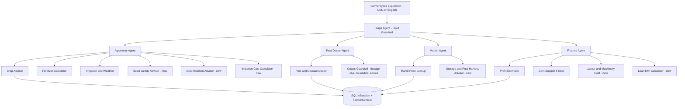

# Kisan Dost (کسان دوست)
### Terminal-Based Multi-Agent AI Agronomy Assistant for Pakistani Farmers

[](https://www.python.org/downloads/)
[](https://github.com/openai/openai-agents-python)
[]()
[](https://opensource.org/licenses/MIT)

**Public GitHub Repository**: [https://github.com/m-rehan-k/kisan-dost-multi-agent-ai](https://github.com/muhammadbilalpak/Kisan-Dost-Agent-Hackathon/tree/main/project)

**Kisan Dost** is an intelligent agronomy extension multi-agent system designed specifically for smallholder and commercial farmers in Pakistan. Built on the **OpenAI Agents SDK (Python)**, it understands queries in English, Urdu, and Roman Urdu (e.g. *"Multan mein Rabi season, 5 acres, limited water — kya lagaun?"*). It automatically routes queries via an intelligent Triage Agent to specialized domain agents equipped with localized agricultural tools, real-world data APIs, persistent SQLite session memory, and dual-layer safety guardrails.

---

## 1. System Architecture

The system follows a strict 5-agent architecture with handoff routing, typed farmer profile context, persistent SQLite session storage, and dual input/output guardrails:



---

## 2. Five Specialist Agents & Responsibilities

The system consists of **exactly 5 agents** with zero unauthorized subagents:

| Agent | Responsibilities & Routing Intent | Guardrails | Output Model |
|---|---|---|---|
| **Triage Agent** | First point of contact. Analyzes farmer intent; routes question to the correct specialist via SDK handoffs. | **Input Guardrail** (`farming_topic_guardrail`): Blocks off-topic / unsafe queries. | Delegated Specialist Output |
| **Agronomy Agent** | Crop selection, NPK fertilizer planning, irrigation schedules, seed varieties, crop rotation, and water source costs. | Inherits Triage input guardrail | `Union[CropPlan, FertilizerPlan, IrrigationAdvice, SeedVarietyRecommendation, RotationAdvice, IrrigationCostEstimate]` |
| **Pest Doctor Agent** | Pest & fungal symptom diagnosis, recommended chemical/biological treatments, and spray instructions. | **Output Guardrail** (`pesticide_safety_guardrail`): Enforces max safe chemical dosage & blocks human medical advice. | `PestDiagnosis` |
| **Market Agent** | Live wholesale commodity rates across Punjab/Sindh mandis and post-harvest storage management. | Inherits Triage input guardrail | `Union[MandiPriceInfo, StorageAdvice]` |
| **Finance Agent** | Comprehensive crop budgets, break-even analysis, government subsidy schemes (Kissan Card), machinery rental, and loan EMI schedules. | Inherits Triage input guardrail | `Union[ProfitEstimate, GovtSupportInfo, LabourMachineryCost, LoanEmiPlan]` |

---

## 3. What Every Tool Does (Complete Suite of 13 Tools)

### Core 7 Agricultural Tools
1. **`crop_advisor`** (Agronomy Agent)
   - *Purpose*: Evaluates district, soil type, season (Kharif/Rabi), water availability, and acreage against Pakistani agronomic baselines. Recommends top 2-3 suitable crops with expected yield and profit.
   - *Inputs*: `district: str`, `soil_type: str`, `season: str`, `water_availability: str`, `land_size_acres: float = 1.0`
   - *Output Schema*: `CropPlan`
2. **`pest_disease_doctor`** (Pest Doctor Agent)
   - *Purpose*: Identifies crop pests (e.g. whitefly, pink bollworm, wheat rust) based on visual symptoms. Returns safe treatment instructions, chemical name, recommended dosage, and maximum safe dosage limit.
   - *Inputs*: `symptoms: str`, `crop: str | None = None`
   - *Output Schema*: `PestDiagnosis`
3. **`fertilizer_calculator`** (Agronomy Agent)
   - *Purpose*: Computes exact bag requirements for Urea, DAP, and Potash based on crop NPK needs and land size. Provides stage-by-stage split application schedule and estimated PKR cost.
   - *Inputs*: `crop: str`, `land_size_acres: float`, `soil_type: str | None = None`
   - *Output Schema*: `FertilizerPlan`
4. **`mandi_price_lookup`** (Market Agent)
   - *Purpose*: Looks up prevailing wholesale mandi prices per maund (40 kg) across Punjab and Sindh districts. Includes market trend analysis and actionable selling recommendations.
   - *Inputs*: `commodity: str`, `district: str | None = None`
   - *Output Schema*: `MandiPriceInfo`
5. **`irrigation_weather_advisor`** (Agronomy Agent)
   - *Purpose*: Integrates Open-Meteo live API to fetch 3-day temperature, rainfall, and humidity forecast. Recommends next irrigation interval and alerts on frost or heatwave risks.
   - *Inputs*: `crop: str`, `district: str`, `water_source: str = "canal"`
   - *Output Schema*: `IrrigationAdvice`
6. **`profit_estimator`** (Finance Agent)
   - *Purpose*: Generates detailed enterprise crop budgets itemizing seed, fertilizer, pesticide, irrigation, labor, and harvesting costs against expected gross revenue and net profit per acre.
   - *Inputs*: `crop: str`, `land_size_acres: float`, `expected_yield_maund_per_acre: float | None = None`, `expected_price_per_maund: float | None = None`
   - *Output Schema*: `ProfitEstimate`
7. **`govt_support_finder`** (Finance Agent)
   - *Purpose*: Matches farmers with active provincial and federal agricultural schemes (Punjab Kissan Card, Solar Tubewell Subsidy, Green Tractor Scheme, mark-up free loans).
   - *Inputs*: `province: str = "Punjab"`, `land_size_acres: float = 5.0`
   - *Output Schema*: `GovtSupportInfo`

### 6 Extra Real-World Tools (PDF Se Aagay)
8. **`seed_variety_advisor`** (Agronomy Agent)
   - *Purpose*: Recommends government-approved, disease-resistant seed cultivars per ecological zone (e.g. Akbar-2019, Dilkash-20 for wheat; BS-15, MNH-886 for cotton).
   - *Inputs*: `crop: str`, `district: str | None = None`
   - *Output Schema*: `SeedVarietyRecommendation(crop: str, recommended_varieties: list[str], region_notes: str)`
9. **`crop_rotation_advisor`** (Agronomy Agent)
   - *Purpose*: Uses `last_crop` from `FarmerContext` (session memory) to recommend the optimal subsequent crop to break pest cycles and restore soil nitrogen.
   - *Inputs*: `last_crop: str`, `season: str | None = None`
   - *Output Schema*: `RotationAdvice(last_crop: str, recommended_next_crop: list[str], reasoning: str)`
10. **`irrigation_cost`** (Agronomy Agent)
    - *Purpose*: Calculates operational pumping cost across diesel tubewell, solar tubewell, electric tubewell, and canal water sources.
    - *Inputs*: `source: str`, `land_size_acres: float`, `crop: str | None = None`
    - *Output Schema*: `IrrigationCostEstimate(source: str, cost_per_irrigation_pkr: float, irrigations_needed: int, total_water_cost_pkr: float)`
11. **`labour_machinery_cost`** (Finance Agent)
    - *Purpose*: Estimates tractor land preparation (rotavator/chisel), laser land leveling, mechanical sowing, harvesting (combine), and labor wages per acre.
    - *Inputs*: `crop: str`, `land_size_acres: float`
    - *Output Schema*: `LabourMachineryCost(land_prep_cost_pkr: float, sowing_cost_pkr: float, harvesting_cost_pkr: float, total_cost_pkr: float)`
12. **`loan_emi_calculator`** (Finance Agent)
    - *Purpose*: Computes monthly installments, markup rates, and total payable amounts for agricultural loans from ZTBL, Bank of Punjab, and mark-up free Kissan Card credit.
    - *Inputs*: `loan_amount_pkr: float`, `tenure_months: int`, `interest_rate_percent: float = 0.0`
    - *Output Schema*: `LoanEmiPlan(loan_amount_pkr: float, tenure_months: int, interest_rate_percent: float, monthly_installment_pkr: float)`
13. **`storage_advisor`** (Market Agent)
    - *Purpose*: Provides grain and produce preservation guidance (moisture levels < 11%, aluminum phosphide fumigation, Purdue Improved Crop Storage [PICS] bags).
    - *Inputs*: `commodity: str`
    - *Output Schema*: `StorageAdvice(recommended_practice: str, estimated_shelf_life_days: int)`

---

## 4. APIs & Datasets Used

1. **Open-Meteo Geocoding API** (`https://geocoding-api.open-meteo.com/v1/search`)
   - *Usage*: Resolves Pakistani district names (Multan, Faisalabad, Khanewal, etc.) to high-precision geographic coordinates without requiring any API key.
2. **Open-Meteo Weather Forecast API** (`https://api.open-meteo.com/v1/forecast`)
   - *Usage*: Fetches real-time temperatures, relative humidity, precipitation probabilities, and 3-day forecasts for intelligent irrigation planning.
   - *Offline-First Fallback*: If internet connectivity is interrupted, the system automatically falls back to curated regional climate baseline tables without raising uncaught exceptions.
3. **Punjab Agriculture Marketing Information System (AMIS) & Benchmarks**
   - *Usage*: Wholesale daily price benchmarks across major grain, cotton, and oilseed markets in Punjab and Sindh.
4. **National Fertilizer Development Centre (NFDC) / PARC Agronomic Tables**
   - *Usage*: Scientific nutrient baselines (N-P-K per acre) for Pakistani soil types (sandy, loamy, clayey).
5. **Punjab Agriculture Extension Pesticide Guidelines**
   - *Usage*: Independent laboratory safety threshold tables (chemical active ingredient maximum limits in ml/L) used by the Output Guardrail.

---

## 5. Dual-Layer Safety Guardrails

### 1. Input Guardrail: `farming_topic_guardrail` (Triage Agent)
- Runs on every incoming farmer prompt before routing.
- Uses `TopicSafetyCheck` (Pydantic model) to evaluate whether the query is related to Pakistani agriculture and safe.
- **Tripwire Behavior**: If a user asks an unrelated question (e.g. *"Pakistan ka PM kaun hai?"*), the tripwire activates and `InputGuardrailTripwireTriggered` is caught gracefully in the REPL, replying:
  > *"Kisan Dost: Ye sawal mere scope se bahar hai — kheti-baari ke baare mein pochain."*

### 2. Output Guardrail: `pesticide_safety_guardrail` (Pest Doctor Agent)
- Evaluates the structured `PestDiagnosis` produced by the Pest Doctor.
- Checks `dosage_ml_per_liter <= max_safe_dosage_ml_per_liter` and verifies against an independent chemical lookup table.
- Scans for and strictly forbids any human medical advice or human pharmaceutical terms (e.g. paracetamol, antibiotics).
- **Tripwire Behavior**: If an unsafe dosage or hazardous substance is recommended, `OutputGuardrailTripwireTriggered` is caught gracefully, replying:
  > *"Kisan Dost: Is jawab ki safety verify nahi ho saki — qareebi agri-expert se rabta karein."*

---

## 6. Session Persistence & Farmer Context

- **Persistent Database**: Uses `SQLiteSession(session_id="farmer_<id>", db_path="data/sessions.db")` to retain chat history and handoff state across terminal restarts.
- **Typed Profile Context**: Every call to `Runner.run` passes the 8-field typed context:
  ```python
  class FarmerContext(BaseModel):
      farmer_name: str | None = None
      district: str | None = None
      province: str | None = None
      land_size_acres: float | None = None
      soil_type: str | None = None
      season: str | None = None
      water_availability: str | None = None
      last_crop: str | None = None  # Essential for Crop Rotation Advisor
  ```

---

## 7. Setup & How to Run

### Step 1: Clone Repository & Create Virtual Environment
```bash
git clone https://github.com/m-rehan-k/kisan-dost-multi-agent-ai.git
cd kisan-dost-multi-agent-ai

python -m venv .venv

# Windows (Command Prompt / PowerShell):
.venv\Scripts\activate

# Linux / macOS:
source .venv/bin/activate

pip install -r requirements.txt
```

### Step 2: Configure Environment Variables
Copy `.env.example` to `.env`:
```bash
# Windows:
copy .env.example .env

# Linux / macOS:
cp .env.example .env
```

Edit `.env` and set your preferred provider key:
```ini
# OpenAI (Default & Recommended)
OPENAI_API_KEY=your-openai-api-key-here
LLM_PROVIDER=openai
LLM_MODEL=gpt-4o-mini

# Optional: Groq or Google Gemini
# GROQ_API_KEY=your-groq-api-key-here
# GOOGLE_API_KEY=your-gemini-api-key-here

# Tracing fallback (prevents connection errors if tracing is unconfigured)
OPENAI_AGENTS_DISABLE_TRACING=1
```

> **Security Guarantee**: `.env` and `data/sessions.db` are explicitly listed in `.gitignore`. Real API keys will **never** be committed to version control.

### Step 3: Run the Application

```bash
# Standard Terminal REPL
python main.py

# WhatsApp-Style Conversational Mode (with timestamps & chat bubbles)
python main.py --whatsapp

# Urdu Script Output Mode
python main.py --urdu --whatsapp
```

---

## 8. 5 Core Demo Scenarios & Verification Tests

Kisan Dost is verified against all 5 source test scenarios (`test_part7_demo.py`):

| Test | Prompt / Scenario | Intended Flow | Expected Result |
|---|---|---|---|
| **Test 1** | *“Multan mein Rabi season, 5 acres, limited water — kya lagaun?”* | Triage → Agronomy Agent (`crop_advisor`) | Recommends low-to-medium water Rabi crops (Wheat, Mustard/Canola, Gram/Chickpea) with yields & profit; excludes high-water crops like rice. |
| **Test 2** | *“Cotton ke pattay curl ho rahe hain, chotay safed keeray hain”* | Triage → Pest Doctor (`pest_disease_doctor`) | Diagnoses Whitefly (Safed Makhi), prescribes Pyriproxyfen 10.8% EC with dosage capped ≤ 4.0 ml/L, passing safety check. |
| **Test 3** | *“Faisalabad mandi mein gandum ka rate kya hai?”* | Triage → Market Agent (`mandi_price_lookup`) | Returns structured rate per maund (~PKR 3,950), date, mandi benchmark, and selling recommendation. |
| **Test 4** | *“Pakistan ka PM kaun hai?”* | Triage Input Guardrail (`farming_topic_guardrail`) | Tripwire activates; gracefully rejects off-topic question with *"Kisan Dost: Ye sawal mere scope se bahar hai — kheti-baari ke baare mein pochain."* |
| **Test 5** | Unsafe dosage question (e.g. 8.0 ml/L) | Pest Doctor Output Guardrail (`pesticide_safety_guardrail`) | Safety check catches dosage exceeding maximum limit (4.0 ml/L); blocks dangerous output and advises consulting local agri-expert. |

---

## 9. Common Mistakes Avoided (Source Audit Checklist)

- [x] **No Unchecked Scope or Extra Agents**: Exactly 5 agents implemented (`Triage`, `Agronomy`, `Pest Doctor`, `Market`, `Finance`).
- [x] **No Unstructured Tool Returns**: Every one of the 13 tools returns a typed Pydantic BaseModel, enabling strict schema validation.
- [x] **No In-Memory Session Loss**: Uses `SQLiteSession` from the Agents SDK stored in `data/sessions.db`, persisting conversations across terminal restarts.
- [x] **Typed Farmer Context Passed**: `FarmerContext` with all 8 fields (including `last_crop` for crop rotation) is passed via `Runner.run(..., context=...)`.
- [x] **Independent Dosage Caps**: The output guardrail uses independent agricultural extension dosage thresholds rather than trusting the LLM alone.
- [x] **No Human Medical Advice**: Strict keyword and regex filtering stops cross-contamination with human pharmaceutical advice.
- [x] **Robust Error Handling**: Zero unhandled crashes when users provide missing values, negative acres, or when Open-Meteo is offline.
- [x] **Secrets Protection**: `.env` and SQLite files are gitignored; `.env.example` provides clean template configuration.

---

## 10. Running the Automated Test Suite

Run the full 28-test suite covering all 7 parts:

```bash
# Run full test suite
python -m pytest test_part2_tools.py test_part3_agents.py test_part4_guardrails.py test_part5_sessions.py test_part6_extras.py test_part7_demo.py -v

# Run Part 7 demo tests standalone
python test_part7_demo.py
```
